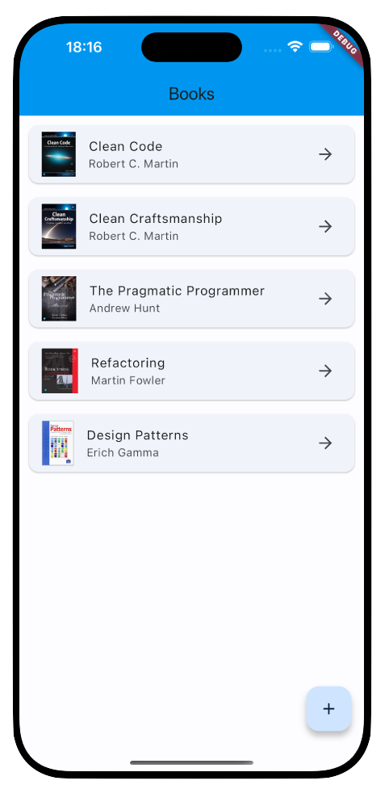
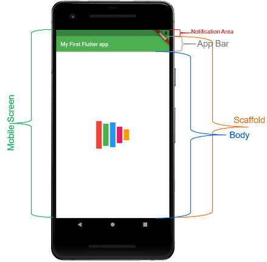

# Applicazione



# Creare un progetto flutter
```bash
flutter create flutter-books
```

pubspec.yaml
[Link](https://pub.dev/)

# Scaffold

[Link](https://api.flutter.dev/flutter/material/Scaffold-class.html)


# Dipendenze
```
dependencies:
    retrofit: ^4.1.0
    logger: any 
    json_annotation: ^4.8.1
    logging: ^1.2.0

dev_dependencies:
    build_runner: ^2.4.9
    retrofit_generator: ^8.1.0
    json_serializable: ^6.6.2
```

## build_runner
Libreria per la generazione di codice.
[Link](https://pub.dev/packages/build_runner)

## json_annotation
Permette di generare il codice necessario per la serializzazione e deserializzazione di oggetti JSON.
[Link](https://pub.dev/packages/json_annotation)

## retrofit
Libreria per la creazione di client REST.
[Link](https://pub.dev/packages/retrofit)

## repository
Creare una classe di repository per la gestione delle chiamate REST.

### comando per generare il codice
```bash
flutter pub run build_runner build
```

## logging
Libreria per la gestione dei log.
[Link](https://pub.dev/packages/logging)


# Widget
## FutureBuilder
[Link](https://api.flutter.dev/flutter/widgets/FutureBuilder-class.html)

## ListView.separated
[Link](https://api.flutter.dev/flutter/widgets/ListView-class.html)

## Card
[Link](https://api.flutter.dev/flutter/material/Card-class.html)

## FloatingActionButton
[Link](https://api.flutter.dev/flutter/material/FloatingActionButton-class.html)

## Nuova pagina per inserire un book
Inserire di nuovo un scaffold
[Link](https://docs.flutter.dev/cookbook/forms/validation)
per inserire il testo nella label
decoration: const InputDecoration(labelText: 'Nome'),

prendo tutti i dati dalla form
onSaved: (value) => _name = value!,

al salvataggio devo salvare i dati nello state
_formKey.currentState!.save();

## Navigator
[Link](https://docs.flutter.dev/cookbook/navigation/navigation-basics)

```dart
Navigator.push(
  context,
  MaterialPageRoute(builder: (context) => const InsertBook()),
).then((_) => setState(() {
  _loadData();
}));
```

```dart
Navigator.pop(context);
```

